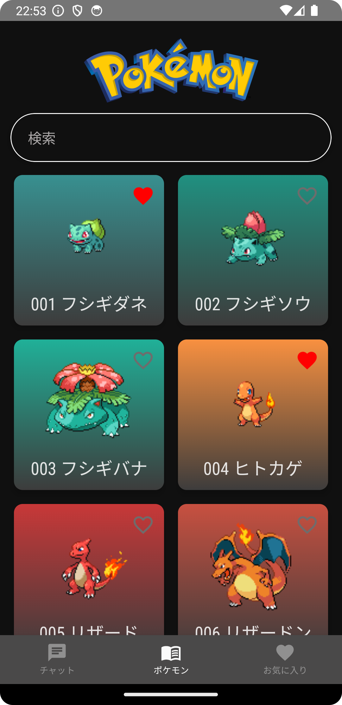
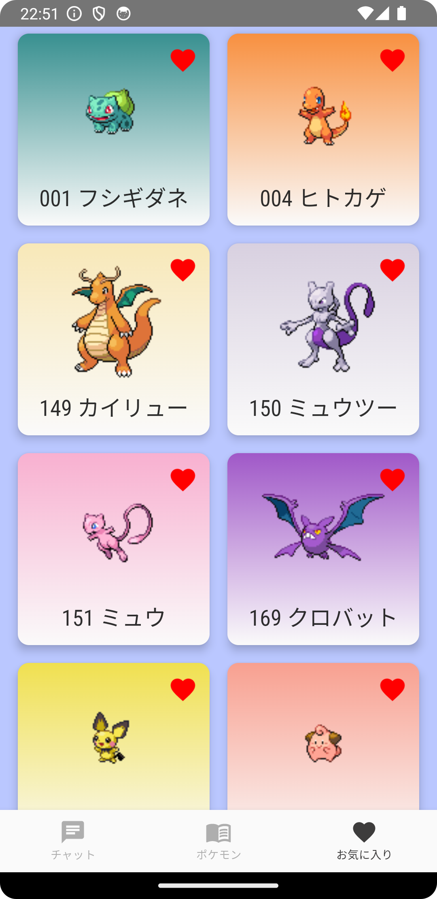
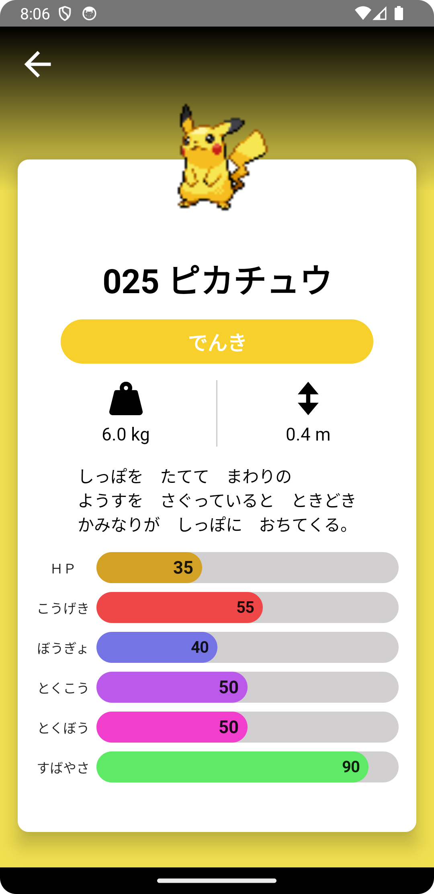
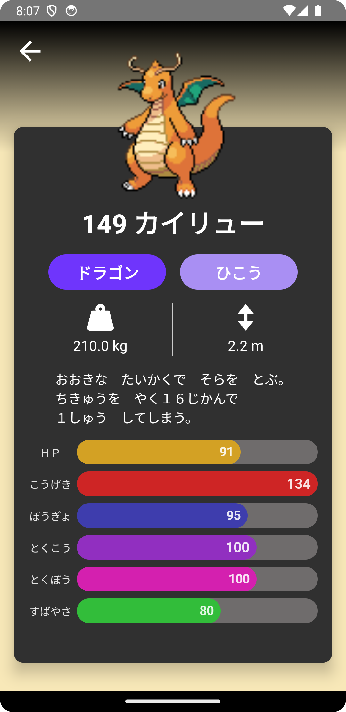
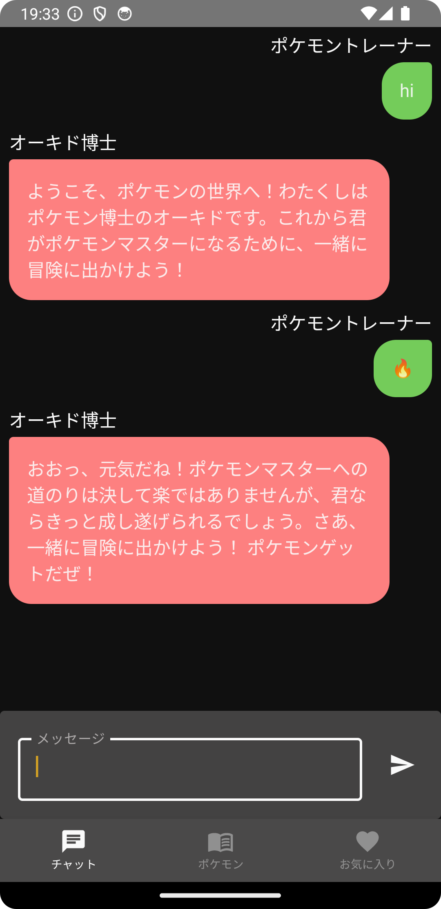

# PokemonDictionary


Pokemon Dictionary written in Kotlin and Compose.  
Now support English, Japanese, Traditional Chinese and Simplified Chinese.  

[Demo Video](https://youtu.be/VlXGaoFUh3c)  

## Introduction
Please add your own API key into `local.properties` after cloning this app.  
You can get Gemini API key [here](https://ai.google.dev/).  

```
apiKey=[your api key]
```

## Screenshots

Light | Dark
:--: | :--:
 | 
 | 
 | 
 | 

## API
- API Documentation: https://pokeapi.co/  
- Pokemon search API endpoint: **GET** https://pokeapi.co/api/v2/pokemon/{id}/  
- Pokemon detail API endpoint: **GET** https://pokeapi.co/api/v2/pokemon-species/{id}/

## Main Libraries Used
- Compose
- Coroutines
- Navigation 
- Palette
- Room
- Dagger Hilt
- Retrofit2
- OkHttp3
- Gson
- Coil
- Gemini AI
